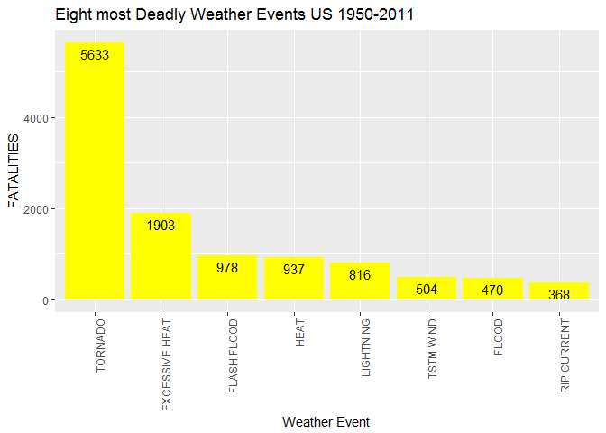
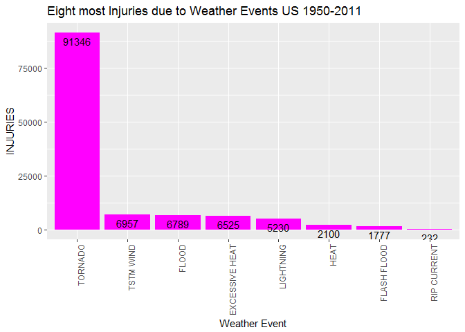
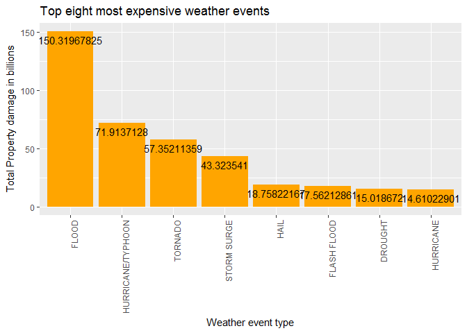

# Storm Data Analysis of National Weather Service Data

######{r setup, include=FALSE}
######knitr::opts_chunk$set(echo = TRUE)


#                       Synopsis
#####    Storms and other severe weather events can cause both public health and economic problems for communities and municipalities.  
#####This project involves exploring the U.S. National Oceanic and Atmospheric Administration's (NOAA) storm database. This database tracks characteristics of major storms and weather events in the United States.


#####    This project attemps to answer two questions:  
#####1) Across the United States, which types of events (as indicated in the "EVTYPE" variable) are most harmful with respect to population health?
#####2) Across the United States, which types of events have the greatest economic consequences?


#                       Data Processing
##### The data ("repdata_data_StormData.csv.bz2") was provided as part of the assignment documents and is included in the Github repo (https://github.com/GaryFH/RepDataStormStudy).  The data is "read" in, converted to a tbl_df and stored as "d1" with the following code:


```r
library(dplyr)
```

```
## Warning: package 'dplyr' was built under R version 3.3.3
```

```
## 
## Attaching package: 'dplyr'
```

```
## The following objects are masked from 'package:stats':
## 
##     filter, lag
```

```
## The following objects are masked from 'package:base':
## 
##     intersect, setdiff, setequal, union
```

```r
library(ggplot2)
```

```
## Warning: package 'ggplot2' was built under R version 3.3.3
```

```r
c1<-read.csv("repdata_data_StormData.csv.bz2",stringsAsFactors = FALSE)
d1<-tbl_df(c1)
```
#### The data is initially examined with the following code:


```r
d1
```

```
## # A tibble: 902,297 × 37
##    STATE__           BGN_DATE BGN_TIME TIME_ZONE COUNTY COUNTYNAME STATE
##      <dbl>              <chr>    <chr>     <chr>  <dbl>      <chr> <chr>
## 1        1  4/18/1950 0:00:00     0130       CST     97     MOBILE    AL
## 2        1  4/18/1950 0:00:00     0145       CST      3    BALDWIN    AL
## 3        1  2/20/1951 0:00:00     1600       CST     57    FAYETTE    AL
## 4        1   6/8/1951 0:00:00     0900       CST     89    MADISON    AL
## 5        1 11/15/1951 0:00:00     1500       CST     43    CULLMAN    AL
## 6        1 11/15/1951 0:00:00     2000       CST     77 LAUDERDALE    AL
## 7        1 11/16/1951 0:00:00     0100       CST      9     BLOUNT    AL
## 8        1  1/22/1952 0:00:00     0900       CST    123 TALLAPOOSA    AL
## 9        1  2/13/1952 0:00:00     2000       CST    125 TUSCALOOSA    AL
## 10       1  2/13/1952 0:00:00     2000       CST     57    FAYETTE    AL
## # ... with 902,287 more rows, and 30 more variables: EVTYPE <chr>,
## #   BGN_RANGE <dbl>, BGN_AZI <chr>, BGN_LOCATI <chr>, END_DATE <chr>,
## #   END_TIME <chr>, COUNTY_END <dbl>, COUNTYENDN <lgl>, END_RANGE <dbl>,
## #   END_AZI <chr>, END_LOCATI <chr>, LENGTH <dbl>, WIDTH <dbl>, F <int>,
## #   MAG <dbl>, FATALITIES <dbl>, INJURIES <dbl>, PROPDMG <dbl>,
## #   PROPDMGEXP <chr>, CROPDMG <dbl>, CROPDMGEXP <chr>, WFO <chr>,
## #   STATEOFFIC <chr>, ZONENAMES <chr>, LATITUDE <dbl>, LONGITUDE <dbl>,
## #   LATITUDE_E <dbl>, LONGITUDE_ <dbl>, REMARKS <chr>, REFNUM <dbl>
```


#### There are 985 different types of weather events in the data - future investigations may want to look and combining some of these events (i.e all heat related events, Hurricane&Hurricane/Typhoon and/or flood&storm-surge, related events) to see additional patterns. The following code produces a plot that shows the top eight weather events based on fatalities.


```r
d2<-group_by(d1,EVTYPE)
d3<-select(d2,EVTYPE,FATALITIES,INJURIES)
d4<-d3##d4<-filter(d3,FATALITIES,!is.na(FATALITIES))
d5<-summarise(d4,FATALITIES=sum(FATALITIES),INJURIES=sum(INJURIES))
d6<-arrange(d5,desc(FATALITIES))
d7<-head(d6,8)
d7
```

```
## # A tibble: 8 × 3
##           EVTYPE FATALITIES INJURIES
##            <chr>      <dbl>    <dbl>
## 1        TORNADO       5633    91346
## 2 EXCESSIVE HEAT       1903     6525
## 3    FLASH FLOOD        978     1777
## 4           HEAT        937     2100
## 5      LIGHTNING        816     5230
## 6      TSTM WIND        504     6957
## 7          FLOOD        470     6789
## 8    RIP CURRENT        368      232
```

```r
g<-ggplot(d7,aes(x=reorder(EVTYPE,-FATALITIES),y=FATALITIES))
plotfatal<-g+geom_col(fill="yellow")+theme(axis.text.x = element_text(angle = 90, hjust = 1))+geom_text(aes(label=FATALITIES), vjust=1.5, color="black")+labs(x="Weather Event",title="Eight most Deadly Weather Events US 1950-2011")
plotfatal
```

<!-- -->


#### The following code shows the top eight weather events based on injuries.


```r
g2<-ggplot(d7,aes(x=reorder(EVTYPE,-INJURIES),y=INJURIES))
plotinjury<-g2+geom_col(fill="magenta")+labs(x="Weather Event",title="Eight most Injuries due to Weather Events US 1950-2011")+theme(axis.text.x = element_text(angle = 90, hjust = 1))+ geom_text(aes(label=INJURIES), vjust=1.5, color="black")
plotinjury
```

<!-- -->


#### The original dataset showing damage amounts in dollars are stored in two variables (PROPDMG & CROPDMG) the values in these columns need to be multiplied by factors that vary per observation - the code below adds two new columns(property damage multiplier - "pdmltplyr" & crop damage multiplier - "cdmltplyr") that make the character codes found in the dataset into numeric factors for each observation.


```r
dd2<-group_by(d1,EVTYPE)
dd25<-mutate(dd2, pdmultplyr = 
        ifelse(PROPDMGEXP == "h" | PROPDMGEXP == "H", 100,
        ifelse(PROPDMGEXP == "k" | PROPDMGEXP == "K", 1000,
        ifelse(PROPDMGEXP == "m" | PROPDMGEXP == "M", 1000000,
        ifelse(PROPDMGEXP == "b" | PROPDMGEXP == "B", 1000000000, 0 )))))
dd26<-mutate(dd25, cdmultplyr=
        ifelse(CROPDMGEXP == "h" | CROPDMGEXP == "H", 100,
        ifelse(CROPDMGEXP == "k" | CROPDMGEXP == "K", 1000,
        ifelse(CROPDMGEXP == "m" | CROPDMGEXP == "M", 1000000,
        ifelse(CROPDMGEXP == "b" | CROPDMGEXP == "B", 1000000000, 0 )))))
dd3<-select(dd26,EVTYPE,PROPDMG:CROPDMGEXP,pdmultplyr,cdmultplyr)
```


####  The resulting "improved" dataframe can now be used to answer the question - which weather events caused the most damage?   The following code applys:


```r
dd35<-mutate(dd3,TotalDamage=(PROPDMG*pdmultplyr)+(CROPDMG*cdmultplyr))

dd4<-filter(dd35,TotalDamage,!is.na(TotalDamage))

dd5<-summarise(dd4,TotalDamage=sum(TotalDamage)/1000000000)
dd6<-arrange(dd5,desc(TotalDamage))
dd7<-head(dd6,8)
dd7
```

```
## # A tibble: 8 × 2
##              EVTYPE TotalDamage
##               <chr>       <dbl>
## 1             FLOOD   150.31968
## 2 HURRICANE/TYPHOON    71.91371
## 3           TORNADO    57.35211
## 4       STORM SURGE    43.32354
## 5              HAIL    18.75822
## 6       FLASH FLOOD    17.56213
## 7           DROUGHT    15.01867
## 8         HURRICANE    14.61023
```

```r
g3<-ggplot(dd7,aes(x=reorder(EVTYPE,-TotalDamage),y=TotalDamage))
plotdamage<-g3+geom_col(fill="orange")+labs(x="Weather Event",title="Eight highest damages due to Weather Events US 1950-2011")+ theme(axis.text.x = element_text(angle = 90, hjust = 1))+geom_text(aes(label=TotalDamage), vjust=1.5)+labs(x="Weather event type",y="Total Property damage in billions",title="Top eight most expensive weather events")
plotdamage
```

<!-- -->


#                       Results

#### Clearly Tornados are the most dangerous weather events per this data set - Tornadoes have the most injuries and most fatalities by far.

#### Tornados also rank 3rd under most costly weather events behind both Hurricans/Typhoons(#2) and Floods(#1). There are 985 different types of weather events in the data - future investigations may want to look and combining some of these events (i.e all heat related events, Hurricane&Hurricane/Typhoon and/or flood&storm-surge, related events) to see additional patterns.

